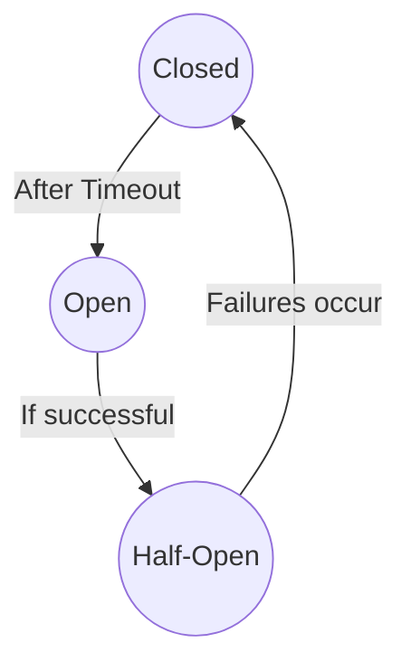

## Circuit Breaker

#### What is the Circuit Breaker Pattern?
This pattern prevents an application from repeatedly trying to execute an operation that’s likely to fail, helping:
- Protect the system from cascading failures
- Improve resilience and stability
- Allow failing services time to recover

> It “breaks the circuit” when a service or dependency is failing, and automatically tries to “close the circuit” after a cool-down period.

## Real-world Analogy

Think of a household electrical circuit breaker:

- If there’s an overload, it cuts off the power to prevent fire or damage.
- After some time, you reset the breaker and power is restored.
- Without it, you risk blowing up your appliances or starting a fire.

## How does it work?

The pattern has three main states:
1. **Closed(Normal)**
- All requests pass through.
- The circuit breaker monitors for failures.
- If failures exceed a configured threshold → it moves to Open.

2. **Open(Tripped)**
- Requests fail immediately without calling the downstream service.
- The system returns fallback responses or errors.
- A timer starts for a recovery period.

3. **Half-Open (Testing)**
- After the recovery period, a limited number of requests are allowed through.
- If they succeed → the breaker moves back to Closed.
- If they fail → the breaker returns to Open.

## Use Cases
- Protecting against:
    - Slow or failing databases
    - Unavailable third-party APIs
    - Overloaded downstream microservices
- Avoiding thread exhaustion in thread pools
- Preventing cascading failures across systems

## Example flow
1. Your app calls a payment service.
2. The payment service starts failing (timeouts or 500 errors).
3. Circuit breaker opens → all further payment requests fail immediately with a fast fallback response.
4. After 30 seconds, the breaker moves to half-open → allows 1-2 test requests.
5. If the payment service recovers → circuit closes. If still failing → circuit reopens.

## Benefits
- Prevents cascading failures
- Improves overall system availability
- Enables faster failure detection and recovery
- Allows degraded (partial) service with fallback behavior