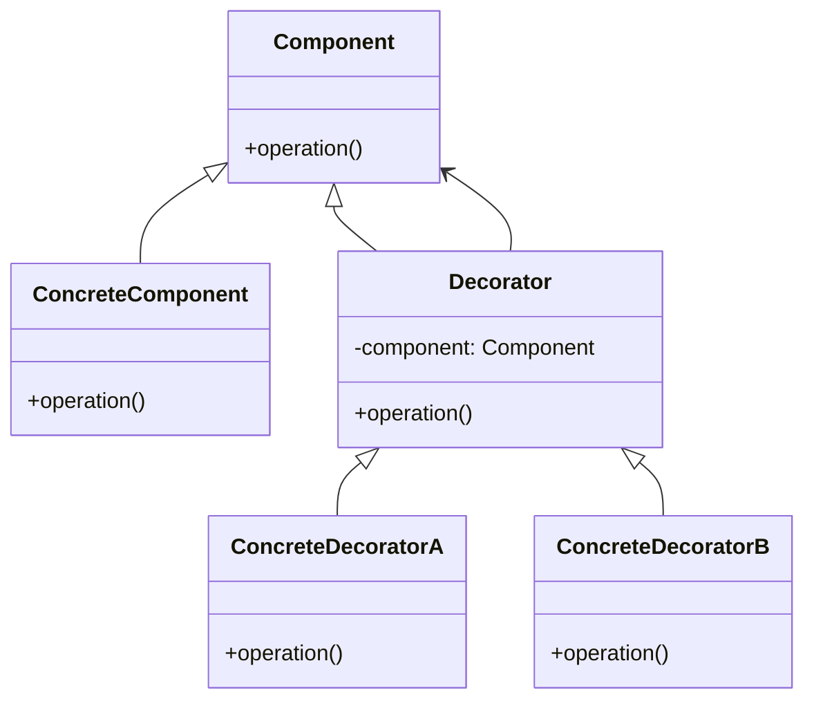
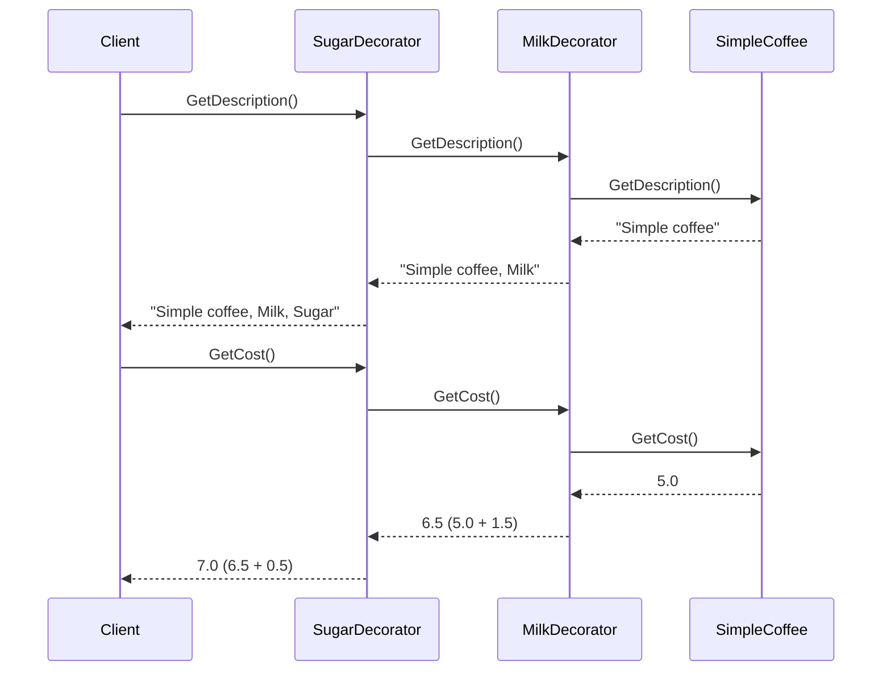

## Decorator Design Pattern

#### What is the Decorator Design Pattern?
It is a structural design pattern that allows you to dynamically add new behaviors, responsibilities, or functionalities to objects without modifying their existing code or using inheritance.

## Structure of Decorator Pattern
- **Component** : The interface or abstract class defining the base behavior.
- **ConcreteComponent** : The main class we want to extend.
- **Decorator** : An abstract class that implements the Component interface and contains a reference to a Component. It delegates work to the component and can add extra behavior.
- **ConcreteDecorator** : A class that extends the Decorator and adds new functionality.

#### Class Diagram:

#### Sequence Diagram:

## Real-World Analogy
Imagine you order a coffee at a café:
- Base coffee → ConcreteComponent.
- You can add milk, add sugar, or add whipped cream → ConcreteDecorators.
- You wrap the coffee object with decorators to dynamically add these extra features without modifying the base Coffee class.

## Advantages
- Adds behavior dynamically
- Follows Open/Closed Principle (open for extension, closed for modification)
- Avoids large inheritance trees

## Disadvantages
- Can result in many small classes
- Harder to debug due to many layers of wrapping

